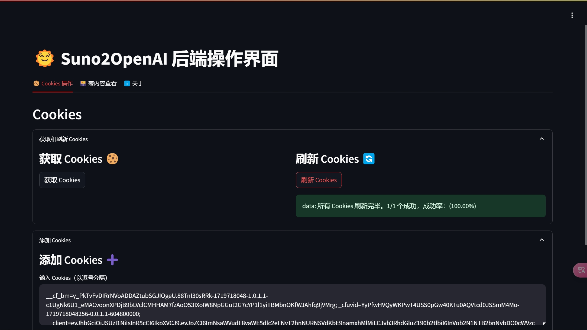

中文 | [English](https://github.com/wlhtea/Suno2openai/blob/main/README.md)

## Suno2openai

> 基于 [SunoSongsCreator](https://github.com/yihong0618/SunoSongsCreator) 和 [Suno-API](https://github.com/SunoAI-API/Suno-API) 项目集成，提供符合 OpenAI 格式的标准化服务接口。

## ✨ 项目亮点

- **OpenAI 格式调用**: 支持流输出。
- **前端兼容性**: 兼容 `chat-next-web` 等前端项目。
- **Docker 部署**: 简化部署流程，支持 `docker-compose`、`docker`。
- **多 Cookie 管理**: 实现多个 Cookie 的轮换。
- **后台管理系统**: 便于非程序员管理数据库和查看项目运行情况。

## 🎉 效果展示
### 💻 管理员后端



## 🚀 未来计划

- 引入请求队列优化。
- 支持自定义参数（如 `tags`、`prompt`、`style` 和歌曲续写）。
- 探索开发类似官方的前端页面。
- 欢迎宝贵建议！📧 **邮箱**: 1544007699@qq.com

---

## 🐳 Docker 部署

本教程提供了使用特定环境变量和端口映射运行 Docker 容器的分步指南。为了本指南的目的，SQL 名称、密码和 IP 地址等敏感信息将被替换为占位符。

### 前提条件

- 您的机器上已安装 Docker。
- 基本的 Docker CLI 知识。
- MySQL 版本 >= 5.7

### 步骤

1. **拉取 Docker 镜像**

   确保您的机器上已有 Docker 镜像 `wlhtea/suno2openai:latest`。如果没有，可以从 Docker 仓库拉取：

   ```bash
   docker pull wlhtea/suno2openai:latest
   ```

2. **运行 Docker 容器**

   使用必要的环境变量和端口映射运行 Docker 容器。将 `<SQL_NAME>`、`<SQL_PASSWORD>` 和 `<SQL_IP>` 替换为实际的 SQL 数据库连接值。这些信息应保密，不要公开分享。

   ```bash
   docker run -d --name wsunoapi \
      -p 8000:8000 \
      -p 8501:8501 \
      -e BASE_URL='<BASE_URL>' \
      -e SESSION_ID='<SESSION_ID>' \
      -e USER_NAME='<USER_NAME>' \
      -e SQL_NAME='<SQL_NAME>' \
      -e SQL_PASSWORD='<SQL_PASSWORD>' \
      -e SQL_IP='127.0.0.1' \
      -e SQL_DK=3306 \
      -e COOKIES_PREFIX='your_cookies_prefix' \
      -e AUTH_KEY='<AUTH_KEY>' \
      -e RETRIES=5 \
      -e BATCH_SIZE=10 \
      -e MAX_TIME=5 \
      --restart=always \
      wlhtea/suno2openai:latest
   ```

   ### 示例

   ```bash
   docker run -d --name wsunoapi \
      -p 8000:8000 \
      -p 8501:8501 \
      -e BASE_URL='https://studio-api.suno.ai' \
      -e SESSION_ID='your-session-id' \
      -e USER_NAME='suno2openaiUsername' \
      -e SQL_NAME='suno2openaiSQLname' \
      -e SQL_PASSWORD='12345678' \
      -e SQL_IP='127.0.0.1' \
      -e SQL_DK=3306 \
      -e COOKIES_PREFIX='your_cookies_prefix' \
      -e AUTH_KEY='your-auth-key' \
      -e RETRIES=5 \
      -e BATCH_SIZE=10 \
      -e MAX_TIME=5 \
      --restart=always \
      wlhtea/suno2openai:latest
   ```

**参数说明：**

- `-d`: 在后台模式下运行容器并记录容器 ID。
- `--name wsunoapi`: 将容器命名为 `wsunoapi` 以便于引用。
- `-p 8000:8000`: 将容器的 8000 端口映射到主机的 8000 端口（后端）。
- `-p 8501:8000`: 将容器的 8501 端口映射到主机的 8000 端口（管理员前端）。
- `-e`: 为容器设置环境变量。
- `--restart=always`: 确保容器始终重启，除非手动停止。

3. **访问应用程序**
   - **接口地址:** 容器运行后，内部的应用程序应可通过 `http://localhost:8000` 或 Docker 主机的 IP 地址的 8000 端口请求接口.
   - **管理员控制台地址:** 访问`http://localhost:8501`访问管理员后端 或者 `http://ip:8501`。

## 注意

在运行 Docker 容器之前，请确保将 `<SQL_NAME>`、`<SQL_PASSWORD>`、`<SQL_IP>` 和 `<your-session-id>` 等占位符替换为实际值。

## 📦 Docker-Compose 部署

_更新时间：2024/6/30 13：18

### 克隆项目到您的服务器

```bash
git clone https://github.com/wlhtea/Suno2openai.git
```

### 创建数据库

创建数据库（名称自定义），记住保存密码，并确保数据库权限设置正确（允许来自所有 IP 或仅来自 Docker 容器 IP 的连接）。

### 配置环境变量

**将 `env.example` 文件重命名为 `.env` 并填写相应的详细信息：**

```plaintext
BASE_URL=https://studio-api.suno.ai
SESSION_ID=your-session-id
USER_NAME=your-username
SQL_NAME=your-database-name
SQL_PASSWORD=your-database-password
SQL_IP=127.0.0.1
SQL_DK=3306
COOKIES_PREFIX=your_cookies_prefix
AUTH_KEY=your-auth-key
RETRIES=5
BATCH_SIZE=10
MAX_TIME=5
```

### 进入项目目录

```bash
cd Suno2openai
```

### 启动 Docker

```bash
docker compose build && docker compose up
```

**注意：**

- **安全组配置**：确保端口 8000和8501 是开放的。
- **HTTPS 支持**：如果前端项目使用 HTTPS，则本项目的代理 URL 也应使用 HTTPS。

---

## 📋 API 请求

### 接口总结

1. **添加 Cookie**: 使用 `/your_cookies_prefix/cookies` 端点添加 Cookie。
2. **获取所有 Cookie**: 使用 `/your_cookies_prefix/cookies` 端点检索所有 Cookie。
3. **删除 Cookie**: 使用 `/your_cookies_prefix/cookies` 端点删除特定 Cookie。
4. **刷新 Cookie**: 使用 `/your_cookies_prefix/refresh/cookies` 端点刷新 Cookie。
5. **生成 Chat Completion**: 使用 `/v1/chat/completions` 端点生成聊天回复。
6. **管理员后端**: 访问ip:8501即可
### 添加 Cookie 示例

您可以使用 `/your_cookies_prefix/cookies` 端点添加 Cookie。以下是使用 Python 的 `requests` 库的示例请求：

```python
import requests

url = "http://localhost:8000/your_cookies_prefix/cookies"
headers = {
    "Authorization": "Bearer your-auth-key",
    "Content-Type": "application/json"
}
data = {
    "cookies": ["cookie1", "cookie2"]
}

response = requests.put(url, headers=headers, json=data)
print(response.text)
```

### 获取所有 Cookie 示例

您可以使用 `/your_cookies_prefix/cookies` 端点检索所有 Cookie。以下是示例请求：

```python
import requests

url = "http://localhost:8000/your_cookies_prefix/cookies"
headers = {
    "Authorization": "Bearer your-auth-key",
    "Content-Type": "application/json"
}

response = requests.post(url, headers=headers)
print(response.text)
```

### 删除 Cookie 示例

您可以使用 `/your_cookies_prefix/cookies` 端点删除特定 Cookie。以下是示例请求：

```python
import requests

url = "http://localhost:8000/your_cookies_prefix/cookies"
headers = {
    "Authorization": "Bearer your-auth-key",
    "Content-Type": "application/json"
}
data = {
    "cookies": ["cookie1", "cookie2"]
}

response = requests.delete(url, headers=headers, json=data)
print(response.text)
```

### 刷新 Cookie 示例

您可以使用 `/your_cookies_prefix/refresh/cookies` 端点刷新 Cookie。以下是示例请求：

```python
import requests

url = "http://localhost:8000/your_cookies_prefix/refresh/cookies"
headers = {
    "Authorization": "Bearer your-auth-key",
    "Content-Type": "application/json"
}

response = requests.get(url, headers=headers)
print(response.text)
```

### 生成 Chat Completion 示例

您可以使用 `/v1/chat/completions` 端点生成聊天回复。以下是示例请求：

```python
import requests

url = "http://localhost:8000/v1/chat/completions"
headers = {
    "Authorization": "Bearer your-auth-key",
    "Content-Type": "application/json"
}
data = {
    "model": "gpt-3.5-turbo",
    "messages": [
        {"role": "system", "content": "You are a helpful assistant."},
        {"role": "user", "content": "Tell me a joke."},
    ]
    # "stream": True  # 取消注释以启用流输出
}

response = requests.post(url, headers=headers, json=data)
print(response.text)
```

### 参数说明

- `BASE_URL`: 默认 API 基础 URL，默认为 `https://studio-api.suno.ai`。
-

 `SESSION_ID`: 会话 ID。
- `USER_NAME`: 数据库用户名。
- `SQL_NAME`: 数据库名称。
- `SQL_PASSWORD`: 数据库密码。
- `SQL_IP`: 数据库 IP 地址。
- `SQL_DK`: 数据库端口，默认是 3306。
- `COOKIES_PREFIX`: Cookie 前缀（记得要以/开头，例如/test）
- `AUTH_KEY`: 授权密钥，默认为当前时间戳。
- `RETRIES`: 重试次数，默认为 5。
- `BATCH_SIZE`: 批处理大小，默认为 10。
- `MAX_TIME`: 最大请求时间（min），默认为 5。

---


## 💌 实习机会

如果您有兴趣欢迎一名拥有数据分析和前后端开发经验的三年级学生进行实习，请联系：

- 📧 **邮箱**: 1544007699@qq.com

**支持我们**：如果您觉得这个项目对您有帮助，请不要犹豫，给它加星 ⭐！我们欢迎任何形式的支持和建议，让我们共同进步！
